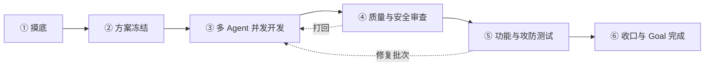

# DaiYu-Agent

**黛玉Agent** 是面向 Cursor、Codex 等 coding agent 的通用多 Agent 软件开发工作流，简称 **黛玉**。

它把一个人的需求转化为可恢复、可审计的 Goal，通过方案冻结、并发开发、独立审查、真实测试与安全验证，让一个人能够稳定调度多个 Agent 完成交付。

[](./VERSION)
[](./LICENSE)
[](https://github.com/vx-zsck2020/DaiYu-Agent/actions/workflows/ci.yml)

## 核心能力

- **一人控制多个 Agent**：Lead 管理目标、文件所有权、批次和闸门，Agent 只处理分配任务。
- **真正并发开发**：开发阶段至少同时运行两个 Task；全栈项目采用 FE/BE 并发，单侧项目采用实现/独立验证并发。
- **Goal 驱动**：Task、报告、修复批次和验收全部绑定同一个 `goal_id`，中断后可从 ledger 精确恢复。
- **证据优先**：完成声明必须附带报告、命令、退出码、改动文件和风险记录。
- **质量与安全闭环**：审查阶段包含质量与安全专节，测试阶段包含功能与攻防验证。
- **合理节省 Token**：使用分层上下文、增量派发、预算阈值和报告落盘，减少重复输入。
- **技术栈可审计**：前端有统一设计规范，后端根据项目特性形成候选矩阵后自动选型。

## 工作流



| 阶段 | 主要职责 | 强制产物 |
|---|---|---|
| ① 摸底 | 读取项目、未提交改动、风险与断点 | `g1-scout.md` |
| ② 方案 | 冻结验收、所有权、威胁面、技术栈和 Token 预算 | `plan.md`、`ownership.md`、`stack-decision.md`、`token-budget.md` |
| ③ 开发 | FE/BE 或实现/验证并发执行 | `g3-*.md`、`g3-verify.md` |
| ④ 审查 | 同一 reviewer 完成质量和安全审查 | `g4-review.md` |
| ⑤ 测试 | 运行真实功能测试和授权范围内攻防用例 | `g5-test.md` |
| ⑥ 收口 | 汇总证据、残留风险并完成 Goal | `g6-close.md` |

## 安装

### Codex

```powershell
git clone https://github.com/vx-zsck2020/DaiYu-Agent.git "$HOME/.codex/skills/DaiYu-Agent"
& "$HOME/.codex/skills/DaiYu-Agent/scripts/selfcheck.ps1"
```

### Cursor

```powershell
git clone https://github.com/vx-zsck2020/DaiYu-Agent.git "$HOME/.cursor/skills/DaiYu-Agent"
& "$HOME/.cursor/skills/DaiYu-Agent/scripts/selfcheck.ps1"
```

Skill 的标准机器标识是 `daiyu-agent`，安装目录和正式英文品牌名是 `DaiYu-Agent`。安装或升级后建议开启新会话，使宿主重新发现 Skill。

## 快速使用

```text
黛玉 为现有项目增加用户与权限管理
黛玉 连续 修复订单并发重复扣款
黛玉 到方案 设计高并发消息推送服务
继续黛玉
```

| 口令 | 行为 |
|---|---|
| `黛玉 <目标>` | 默认模式，每个关键闸等待 Owner 确认 |
| `黛玉 连续 <目标>` | 自动推进，遇审查打回、测试失败或阻塞时停止 |
| `黛玉 到<闸> <目标>` | 完成指定阶段后停止 |
| `继续黛玉` | 读取原 Goal 和 ledger，从下一未完成阶段恢复 |

兼容旧口令：`六闸`、`6gates`、`6gates go`、`solo-team`、`继续六闸`。

## 工作区

黛玉Agent 不依赖对话记忆推进任务。每个 Goal 都有独立工作目录：

```text
work/DaiYu-Agent/<slug>/
├── ledger.md
├── plan.md
├── ownership.md
├── stack-decision.md
├── token-budget.md
└── reports/
    ├── g1-scout.md
    ├── g2-plan.md
    ├── g3-fe.md / g3-be.md / g3-verify.md
    ├── g4-review.md
    ├── g5-test.md
    └── g6-close.md
```

`ledger.md` 是唯一进度真相源，保存 Goal 状态、批次、事件号、阻塞原因和恢复位置。历史 `work/six-gates` 工作区仍可识别和恢复。

## 多 Agent 控制面

- `Agent Registry`：规定每类 Agent 的能力、读写路径、网络范围、预算和报告。
- `ownership.md`：同一时刻每个文件只能由一个写码 Agent 持有。
- `fan-out / fan-in`：Lead 先登记批次，再并发派发；证据全部满足后才合流。
- `heartbeat`：记录 Task 启动、心跳、完成与超时状态。
- 幂等重派：终态 `task_id` 不复用，重试使用新 attempt 并记录 `retry_of`。
- Goal 守卫：只有六个阶段全部通过后，Goal 才能进入 `COMPLETED`。

详细协议：

- [Agent Registry](./agent-registry.md)
- [Control Plane](./control-plane.md)
- [Evidence Schema](./evidence-schema.md)
- [Task 派发协议](./dispatch.md)

## 前端规范

默认设计资源：

- 管理后台：[DevUI Admin Page](https://devui.design/admin-page/docs/getting-started)
- 普通前端：[DevUI](https://devui.design/home)
- 图标：[DevUI Icon](https://devui.design/icon/ruleResource)

方案阶段必须记录项目形态、组件库、图标来源、主题、响应式与无障碍策略。已有项目优先尊重现有设计系统；采用其他组件库时必须在 `stack-decision.md` 中说明兼容性与例外理由。

## 后端自动选型

黛玉Agent 不固定后端框架。方案 Agent 会根据以下条件比较候选技术栈：

- 项目现有语言、框架和依赖
- 流量、吞吐、延迟和并发模型
- 数据结构、一致性、事务与索引需求
- 部署环境、运维能力和可观测性
- 团队维护成本、迁移成本和回滚能力
- 安全、合规与供应链边界

最终决策写入 `stack-decision.md`，包括候选矩阵、评分依据、选择理由、放弃项、验证指标和回滚方案。

## Token 治理

上下文按三层组织：稳定前缀（Goal、规则和契约）、阶段上下文（方案、所有权和安全）、Task 增量（当前 Agent 所需文件与 diff）。

- 使用达到 70%：压缩上下文并保留关键证据路径。
- 使用达到 85%：停止非必要探索。
- 使用达到 95%：只允许收口或阻塞处理。
- 长报告写入文件，对话仅返回状态、摘要和报告路径。

## 安全与测试

- ④ 必须包含 `## 安全审查`，覆盖凭证泄露、鉴权、注入、SSRF、危险配置和供应链风险。
- ⑤ 必须包含功能测试命令、退出码及 `## 攻防测试`。
- 未取得外部目标授权时，只执行静态和本地可复现测试，并记录 `attack_act=skipped_no_auth` 与残留风险。
- 测试失败或安全审查打回后，只允许创建修复批次，不得继续加入新需求。

完整规则见 [security.md](./security.md)。

## 验证与开发

```powershell
./scripts/selfcheck.ps1
```

Codex 环境还可运行官方 Skill validator：

```powershell
python "$HOME/.codex/skills/.system/skill-creator/scripts/quick_validate.py" .
```

提交与 Pull Request 会通过 GitHub Actions 自动执行基础契约检查。版本记录见 [CHANGELOG.md](./CHANGELOG.md)。

## 兼容性

- 正式名称：DaiYu-Agent
- Skill ID：`daiyu-agent`
- 中文名称：黛玉Agent
- 简称：黛玉
- 旧称：六闸 / Six Gates
- 支持平台：Cursor、Codex；其他支持 Markdown Skill 目录的 Agent 可按需适配。

## License

[MIT](./LICENSE) © 2026 vx-zsck2020
