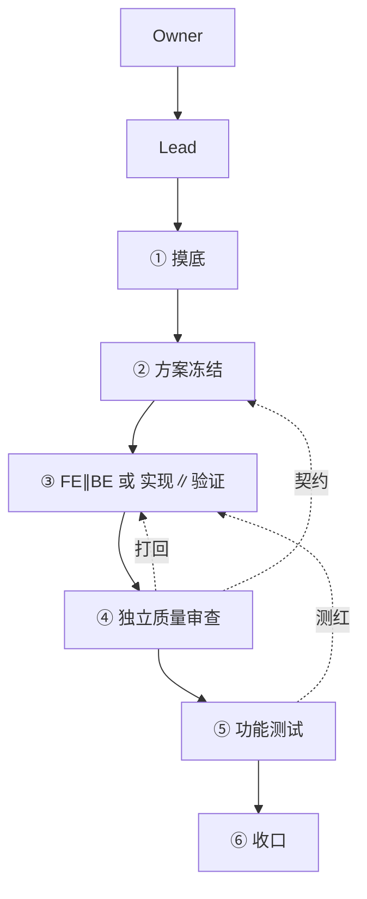
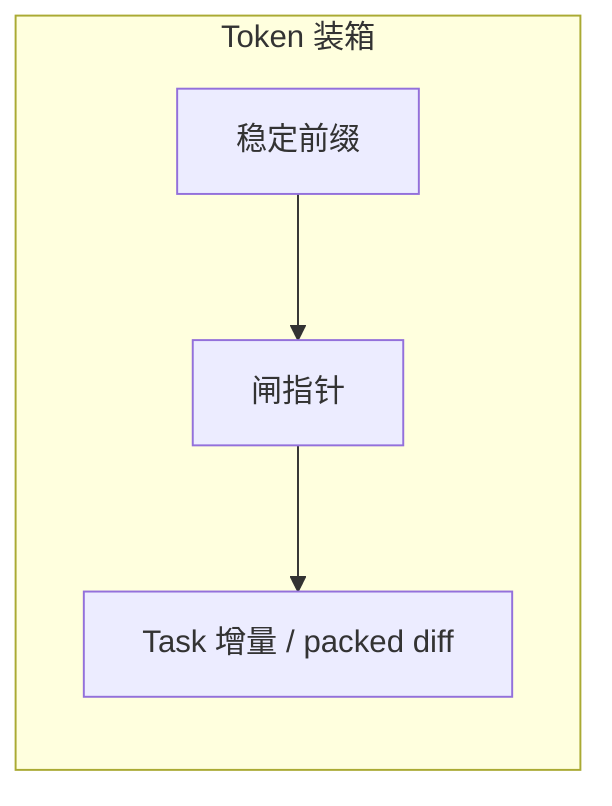
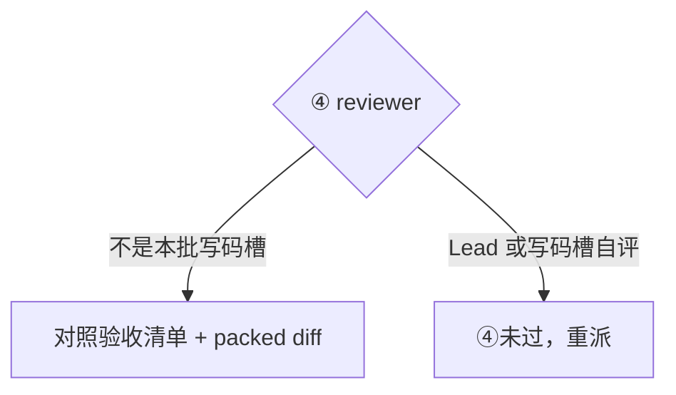

# 黛玉Agent · 关系图

```mermaid
flowchart TB
  YOU["Owner"]
  L["Lead"]
  YOU --> L
  L --> G1["① 摸底"]
  G1 --> G2["② 方案冻结"]
  G2 --> G3["③ FE∥BE 或 实现∥验证"]
  G3 --> G4["④ 独立质量审查"]
  G4 --> G5["⑤ 功能测试"]
  G5 --> G6["⑥ 收口"]
  G4 -.->|打回| G3
  G5 -.->|测红| G3
  G4 -.->|契约| G2
```

```mermaid
flowchart LR
  subgraph pack["Token 装箱"]
    P["稳定前缀"]
    I["闸指针"]
    D["Task 增量 / packed diff"]
  end
  P --> I --> D
```

```mermaid
flowchart TB
  R{"④ reviewer"}
  R -->|不是本批写码槽| OK["对照验收清单 + packed diff"]
  R -->|Lead 或写码槽自评| FAIL["④未过，重派"]
```
