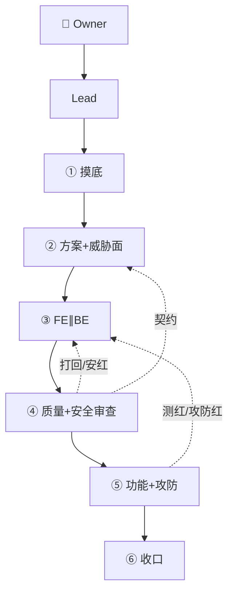
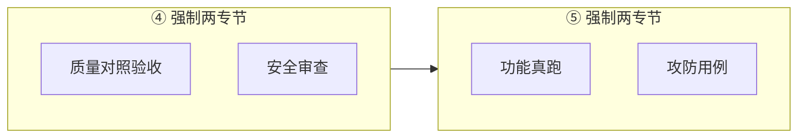
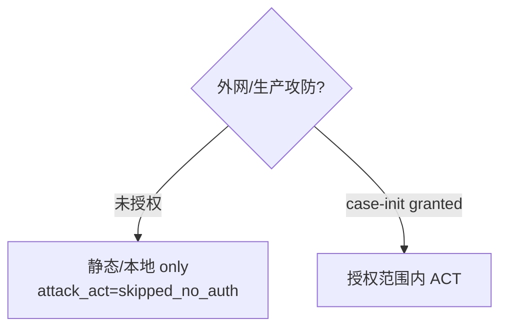

# 黛玉Agent · 关系图

```mermaid
flowchart TB
  YOU["👤 Owner"]
  L["Lead"]
  YOU --> L
  L --> G1["① 摸底"]
  G1 --> G2["② 方案+威胁面"]
  G2 --> G3["③ FE∥BE"]
  G3 --> G4["④ 质量+安全审查"]
  G4 --> G5["⑤ 功能+攻防"]
  G5 --> G6["⑥ 收口"]
  G4 -.->|打回/安红| G3
  G5 -.->|测红/攻防红| G3
  G4 -.->|契约| G2
```

```mermaid
flowchart LR
  subgraph g4["④ 强制两专节"]
    Q["质量对照验收"]
    S["安全审查"]
  end
  subgraph g5["⑤ 强制两专节"]
    F["功能真跑"]
    A["攻防用例"]
  end
  g4 --> g5
```

```mermaid
flowchart TB
  AUTH{"外网/生产攻防?"}
  AUTH -->|未授权| STATIC["静态/本地 only<br/>attack_act=skipped_no_auth"]
  AUTH -->|case-init granted| ACT["授权范围内 ACT"]
```
